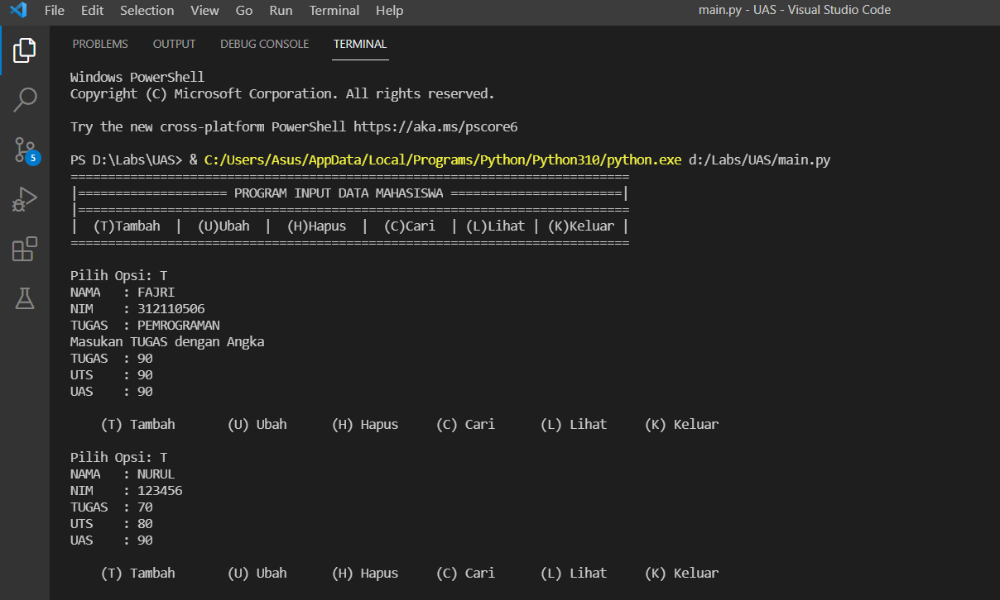
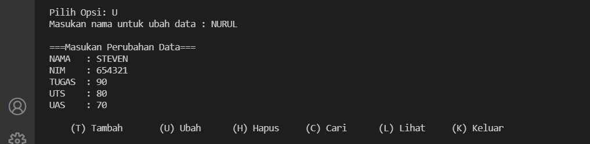
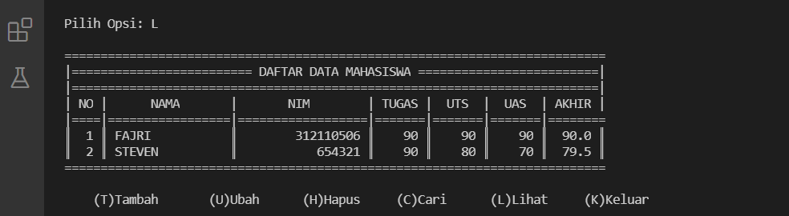
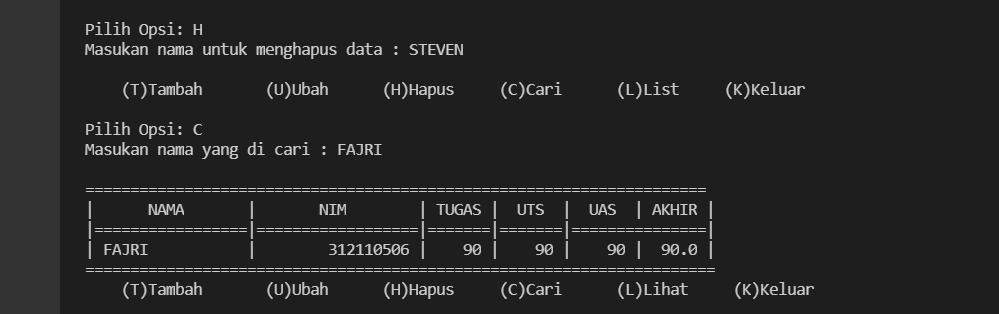
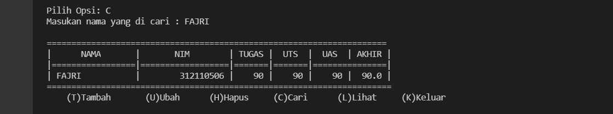
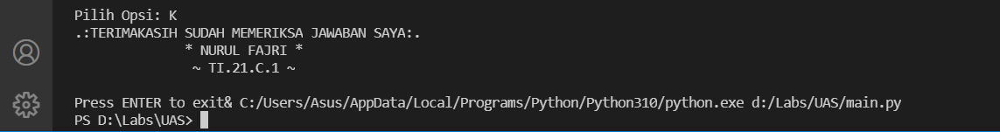

# UAS

## daftar_nilai.py berisi modul untuk :

*tambah_data   
*ubah_data  
*hapus_data   
*cari_data   

## view_nilai.py berisi modul untuk :

*cetak_daftar_nilai   
*cetak_hasil_pencarian   

## input_nilai.py berisi modul untuk :

*input_data (yang meminta pengguna memasukkan data).

## main.py berisi program utama (menu pilihan yang memanggil semua menu yang ada).

### Output untuk tambah_data

### Output untuk ubah_data

### Output untuk lihat_data

### Output untuk hapus_data

### Output untuk cari _data

### Output untuk keluar

 